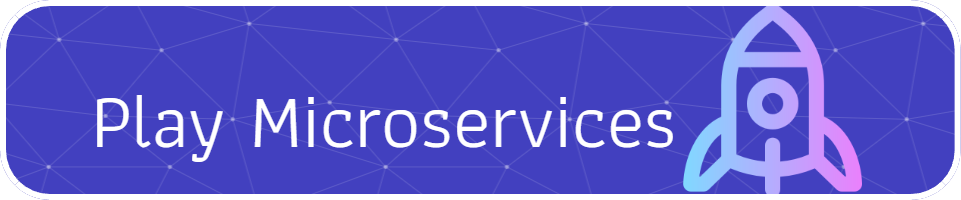

# play-microservices
A simple job scheduler app using microservices architecture. Users can sign up (as admin or normal role).
 - Admins can query the list of all users.
 - Admins can schedule email jobs to be run in the future.
 - Admins can query the reports.

Just run `docker-compose up` from the root directory(This downloads half of the internet onto your computer! A considerable amount of disk space is needed!). Then go to http://localhost:3000/

## Articles:
 - Plan: [Read](https://dev.to/khaledhosseini/play-microservices-birds-eye-view-3d44)
 - Authentication service: Rust [Read](https://dev.to/khaledhosseini/play-microservices-authentication-4di3)
 - Scheduler service: Go [Read](https://dev.to/khaledhosseini/play-microservices-scheduler-19km)
 - Email service: Python [Read](https://dev.to/khaledhosseini/play-microservices-email-service-1kmc)
 - Report service: Python [Read](https://dev.to/khaledhosseini/play-microservices-report-service-4jcm)
 - API gateway service: Go [Read](https://dev.to/khaledhosseini/play-microservices-api-gateway-service-4a9j)
 - Client service: Typescript [Read](https://dev.to/khaledhosseini/play-microservices-client-service-4jbf)
 - Integration via docker-compose: [Read](https://dev.to/khaledhosseini/play-microservices-integration-via-docker-compose-2ddc)
 - Security: [Read](https://dev.to/khaledhosseini/play-microservices-security-45e4)

---

## Choreography

 

---

## CI / CD Flow diagram

 
 
---

## Technologies per service

- **_Auth service_**
  - [Rust](https://www.rust-lang.org/): Programming language
  - [postgres](https://www.postgresql.org/): database
  - [redis](https://redis.io/): cache
  - [Tonic](https://github.com/hyperium/tonic): gRPC framework for Rust
  - [Diesel](https://diesel.rs/): Query builder and ORM for our database communication.
  - [Redis ](https://docs.rs/redis): For our redis server communications in rust.

- **_Scheduler service_**
  - [Golang](https://go.dev/) : programming language
  - [gRPC-GO](https://pkg.go.dev/google.golang.org/grpc): gRPC framework for golang
  - [Mongo driver](https://pkg.go.dev/go.mongodb.org/mongo-driver): Query builder for our database communication.
  - [Kafka go](https://pkg.go.dev/github.com/segmentio/kafka-go) for our message broker communications from go.
  - [Quartz ](github.com/reugn/go-quartz) for scheduling purposes.

- **_Email job executor service_**
  - [Python](https://www.python.org/) : programming language
  - [Kafka-python](https://pypi.org/project/kafka-python/): For our message broker communications from go.

- **_Reports service_**
  - [Python](https://python.org/) : programming language
  - [grpc](https://pypi.org/project/grpc/): gRPC framework for python
  - [Pymongo](https://pypi.org/project/pymongo/): Query builder for our database communication.
  - [Kafka-Python](https://pypi.org/project/kafka-python/) for our message broker communications from python.
  - [grpcio-tools](https://pypi.org/project/grpcio-tools/) For compiling .proto files to python.

- **_API gateway service_**
  - [Golang](https://go.dev/) : programming language
  - [gRPC-GO](https://pkg.go.dev/google.golang.org/grpc): gRPC framework for golang
  - [Gin](https://gin-gonic.com/):  Is a web framework written in Golang
  - [gin-swagger](https://github.com/swaggo/gin-swagger) for our rest api documentation.

- **_Client service_**
  - [Typescript](https://www.typescriptlang.org/) : Programming language
  - [Next.js](https://nextjs.org/): Web framework that can be used for developing backend and front-end applications.
  - [Tailwind css](https://tailwindcss.com/):  A utility-first CSS framework 
  - [react-hook-form](https://react-hook-form.com/docs)
  - [TanStack Query](https://tanstack.com/query/latest): An asynchronous state management.

---

## How to add my simple service?
 - Backend GRPC service
   - Create and develop your gRPC service independently. For authentication, consider accepting an environment variable called `AUTH_PUBLIC_KEY_FILE` to read authentication public key for verifying authorization header which is a simple jwt with `role` (admin or user ) for authorization.
   - Do the follwing to the api-gateway service (For more info see [Here](https://dev.to/khaledhosseini/play-microservices-api-gateway-service-4a9j)).
     - Put your .proto file inside proto folder. Run `source build_grpc.sh` to compile your .proto file.
     - In api-gateway, inside `internal/models` folder create a file named `<yourmodelname>` and create the necessary rest layer models and the conversion to/from proto models.
     - Add `<YOURSERVICE>_URL` to the config/config.go
     - Create a folder named `<yourmodelname>` inside `internal/models` 
     - Inside `<yourmodelname>` folder create a folder named grpc and then a file named client_service.go. Put your grpc service communication logic here (Read `<YOURSERVICE>_URL` from config).
     - Inside `<yourmodelname>` folder create a folder named handler and then a file named handler.go. Put your rest api for your grpc model here.
     - Add your rest-api end points to internal/api/router.go
 - Front-end service
   - Check the api-gateway rest api from [here](http://localhost:5010/swagger/index.html).
   - Develop your client application to communicate with the rest api.

Finally add your service to the docker-compose.yml of the play-microservices. Add `<YOURSERVICE>_URL` to the api gateway environment variables. Also add `AUTH_PUBLIC_KEY_FILE=/run/secrets/auth-access-public-key` environemt variable to your service.

---

## Developing / Debuging
Services have been developed independently from each other. To debug each of the services, just run `docker-compose up -d --build` from the folder of the service. Then using [VSCode](https://code.visualstudio.com/) extension [Dev Containers](https://marketplace.visualstudio.com/items?itemName=ms-vscode-remote.remote-containers) attach to the running container (Each service has several other dependent services in developement. Select the main service). Then open `usr/src/app` folder inside the container and finally run the appropriate commands based on the project (For more information on how to debug the services, see articles above).
Example: Auth service
 - cd to `auth` folder
 - Run `docker-compose up -d --build`
 - While running, click on the bottom left button to open a remote window via  [Dev Containers](https://marketplace.visualstudio.com/items?itemName=ms-vscode-remote.remote-containers)
 - Select attach to running container then select `authentication-service`. Wait until the vscode new window starts.
 - Open folder `usr/src/app` inside container. This folder is mounted to `auth-service` folder inside the host.
 - Open a new terminal and run `cargo run`
 - Start debugging. For more info see [Here](https://dev.to/khaledhosseini/play-microservices-authentication-4di3)

---

## Roadmap

 - Add tests
 - Add tracing
 - Deploy to CI/CD environment via Jenkins

---

## License

MIT License
